# Weekly Product Pulse & Fee Explainer — Phase-Wise Architecture

> **Goal:** Turn the last 12 weeks of INDMoney Play Store reviews into a scannable one-page weekly pulse (≤ 250 words) and a ready-to-send draft email.

---

## High-Level System Flow

```
┌──────────┐  ┌──────────┐  ┌──────────┐  ┌──────────┐  ┌──────────┐  ┌──────────┐  ┌──────────┐  ┌──────────┐
│ Phase 1  │─▶│ Phase 2  │─▶│ Phase 3  │─▶│ Phase 4  │─▶│ Phase 5  │─▶│ Phase 6  │─▶│ Phase 7  │─▶│ Phase 8  │
│  Data    │  │ Cleaning │  │LLM Theme │  │ Grouping │  │  Weekly  │  │ Web UI & │  │  Email   │  │Scheduler │
│ Ingest   │  │  & PII   │  │Generation│  │  into    │  │  Note    │  │ Backend  │  │  Draft   │  │ (GitHub  │
│(PlayStore│  │ Filtering│  │          │  │ Themes   │  │Generation│  │          │  │& Delivery│  │ Actions) │
│ Reviews) │  │ (2a, 2b) │  │          │  │          │  │(One-Pager│  │          │  │          │  │          │
└──────────┘  └──────────┘  └──────────┘  └──────────┘  └──────────┘  └──────────┘  └──────────┘  └──────────┘
```

---

## Phase 1 — Data Ingestion (Play Store Reviews)

### Objective
Fetch the **last 12 weeks** of public Play Store reviews for the **INDMoney** app.

### Approach
| Option | Library / API | Notes |
|--------|--------------|-------|
| **Primary** | `google-play-scraper` (Python) | Public API wrapper; no login required |
| **Fallback** | Pre-exported CSV/JSON | Manual export from public review aggregator sites |

### Data Schema (per review)

| Field | Type | Example |
|-------|------|---------|
| `rating` | int (1–5) | `3` |
| `text` | str | `I like the UI but the fee structure...` |
| `date` | ISO 8601 | `2026-01-15` |
| `review_id` | str (hash) | `a8f3c...` (internal, not exposed) |

### Constraints
- **Public reviews only** — no scraping behind authentication walls.
- Reviews older than ~12 weeks are discarded.
- No PII is stored (usernames, emails, device IDs are stripped at this stage).

### Output
`data/raw_reviews.json` — array of review objects.

### Key Files
```
phase1_ingestion/
├── fetch_reviews.py      # Scraper using google-play-scraper
├── config.py             # App ID, date range, language filters
└── tests/
    └── test_fetch.py     # Validates schema, date range, PII absence
```

---

## Phase 2 — Cleaning & Privacy Filtering

Phase 2 is split into two sub-phases to keep responsibilities clearly separated.

### Phase 2a — Cleaning

#### Objective
Normalize, filter, and deduplicate raw review text before privacy filtering.

#### Pipeline Steps

```
Raw Reviews ──▶ Remove Short Reviews ──▶ Remove Emojis ──▶ Normalize Text ──▶ Deduplicate ──▶ Normalized Reviews
```

1. **Remove short reviews** — discard any review with **fewer than 5 words** (too brief to extract meaningful themes).
2. **Remove emojis** — strip all emoji characters from review text to ensure clean LLM input.
3. **Normalize** — lowercase, fix encoding, collapse whitespace.
4. **Deduplication** — remove exact and near-duplicate reviews (Jaccard similarity > 0.9).
5. **Validation** — assert expected schema fields are intact.

#### Output
`data/normalized_reviews.json` — deduplicated, normalized review objects.

#### Key Files
```
phase2_cleaning/
├── cleaner.py            # Text normalization pipeline
├── deduplicator.py       # Near-duplicate detection
└── tests/
    └── test_cleaning.py  # Normalization accuracy, dedup tests
```

---

### Phase 2b — Privacy Filtering

#### Objective
**Strip any residual PII** from normalized reviews before they reach the LLM.

#### PII Redaction Rules

| PII Type | Pattern | Replacement |
|----------|---------|-------------|
| Email addresses | `user@domain.com` | `[EMAIL]` |
| Phone numbers | `+91-XXXXXXXXXX` | `[PHONE]` |
| Usernames / @mentions | `@username` | `[USER]` |
| UPI IDs / account numbers | `user@upi`, bank account nos. | `[REDACTED]` |

#### Pipeline Steps

```
Normalized Reviews ──▶ Regex PII Scan ──▶ Redact Matches ──▶ Validate Zero PII ──▶ Clean Reviews
```

1. **Regex + Heuristic scan** — detect all PII patterns.
2. **Redact** — replace each match with its placeholder token.
3. **Validate** — assert no PII tokens remain (second-pass check).

#### Output
`data/clean_reviews.json` — deduplicated, PII-free review objects.

#### Key Files
```
phase2_cleaning/
├── pii_filter.py         # Regex-based PII redaction
├── pii_validator.py      # Second-pass PII leak checker
└── tests/
    └── test_pii.py       # PII leak tests, redaction accuracy
```

---

## Phase 3 — LLM Theme Generation

### Objective
Use **Groq** (LLM inference provider) to identify **3–5 recurring themes** across the cleaned reviews.

> **Note:** This phase only *discovers* themes. Review-to-theme assignment happens in Phase 4.

### LLM: Groq LLaMA 3.3 70B Versatile

| Setting | Value |
|---------|-------|
| **Provider** | Groq |
| **Model** | `llama-3.3-70b-versatile` |
| **Why Groq + LLaMA** | Extremely fast inference, generous free tier, strong reasoning at 70B scale |
| **API** | `groq` Python SDK |

### Approach

**Prompt strategy:**

```
System: You are a product analyst. Given a batch of mobile app reviews,
identify the top 3-5 recurring themes. Each theme should be:
  - A short label (≤ 5 words)
  - A one-sentence description

User: Here are the reviews:
{batch_of_reviews}

Return JSON: [{"theme": "...", "description": "..."}, ...]
```

- Send reviews in **batches of 50** to stay within context limits.
- Merge/deduplicate themes across batches using semantic similarity.
- **Cap at 5 themes maximum.**

### Output
`data/themes.json` — list of themes with descriptions.

### Key Files
```
phase3_theme_generation/
├── theme_generator.py    # LLM-based theme discovery (via Groq LLaMA 3.3 70B)
├── prompts.py            # All prompt templates (versioned)
├── groq_client.py        # Groq API client wrapper
└── tests/
    └── test_themes.py    # Theme count ≤ 5, valid labels/descriptions
```

---

## Phase 4 — Grouping into Themes

### Objective
Assign **each cleaned review to one of the themes** discovered in Phase 3.

### LLM: Groq LLaMA 3.3 70B Versatile

| Setting | Value |
|---------|-------|
| **Provider** | Groq |
| **Model** | `llama-3.3-70b-versatile` |
| **Why Groq + LLaMA** | Fast batch classification, strong reasoning at 70B scale |

### Approach

**Prompt strategy:**

```
System: Classify each review into one of these themes: {themes_list}.
If a review doesn't clearly fit any theme, assign it to "Other".

Return JSON: [{"review_id": "...", "theme": "..."}, ...]
```

- Send reviews in **batches of 50** to stay within context limits.
- Every review gets **exactly one theme**.
- Reviews that don't fit any theme → `"Other"` (capped — if "Other" dominates, re-run Phase 3 with broader prompts).

### Validation
- All reviews must be assigned a theme.
- Theme distribution is logged (alert if one theme has > 60% of reviews).

### Output
`data/themed_reviews.json` — each review now has a `theme` field.
`data/themes.json` — updated with review counts per theme.

### Key Files
```
phase4_grouping/
├── theme_classifier.py   # LLM-based review → theme assignment (via Groq LLaMA 3.3 70B)
├── prompts.py            # Classification prompt templates
├── groq_client.py        # Groq API client wrapper
├── validator.py          # Checks all reviews assigned, distribution balance
└── tests/
    └── test_grouping.py  # All reviews assigned, no orphans, distribution checks
```

---

## Phase 5 — Weekly Note Generation (One-Pager)

### Objective
Generate a **≤ 250-word, scannable weekly note** containing:

| Section | Content |
|---------|---------|
| **📊 Top 3 Themes** | Theme label + 1-line summary + review count |
| **💬 3 Real User Quotes** | Verbatim (PII-free) quotes, one per theme |
| **💡 3 Action Ideas** | Concrete next-step suggestions tied to themes |

### LLM: Groq LLaMA 3.3 70B Versatile

| Setting | Value |
|---------|-------|
| **Provider** | Groq |
| **Model** | `llama-3.3-70b-versatile` |
| **Why Groq + LLaMA** | Extremely fast inference, generous free tier, strong reasoning & writing quality at 70B scale |
| **API** | `groq` Python SDK |

### Prompt Strategy

```
System: You are a product communications writer. Create a one-page weekly
pulse note (≤ 250 words, scannable format) from the themed review data below.

Include exactly:
- Top 3 themes with counts
- 3 real user quotes (one per theme, verbatim, no PII)
- 3 actionable recommendations

Format: Use markdown with headers, bullets, and bold.

User: {themed_reviews_summary}
```

### Output Format (Markdown)

```markdown
# 📋 INDMoney Weekly Product Pulse
**Week of March 2–8, 2026** | Reviews analyzed: 142

## 📊 Top Themes This Week
1. **Fee Transparency** (47 reviews) — Users want clearer breakdowns...
2. **App Crashes on Android 14** (31 reviews) — Repeated force-closes...
3. **Mutual Fund UX** (28 reviews) — Difficulty comparing fund options...

## 💬 What Users Are Saying
> "I love the app but I can never figure out where the charges come from."
> "Crashes every time I try to view my portfolio on my Pixel 8."
> "Comparing mutual funds shouldn't require 10 taps."

## 💡 Suggested Actions
1. Add a fee breakdown tooltip on the transaction detail screen.
2. Prioritize Android 14 crash fix in next sprint.
3. Redesign mutual fund comparison as a side-by-side table.
```

### Output
`output/weekly_note_{date}.md` — the formatted weekly note.

### Key Files
```
phase5_note_generation/
├── note_generator.py     # LLM-powered note writer (via Groq LLaMA 3.3 70B)
├── note_template.py      # Markdown templates & formatting
├── word_counter.py       # Validates ≤ 250 words
├── groq_client.py        # Groq API client wrapper
└── tests/
    └── test_note.py      # Word count, section presence, quote count
```

---

## Phase 6 — Web UI & Backend

### Objective
Provide a **web interface** where the user can:

1. **View the generated weekly note** in a clean, formatted layout.
2. **Enter recipient details** — name and email address — for sending the pulse email.
3. **Trigger email delivery** with a single click.

### Architecture

```
┌──────────────────────┐         ┌──────────────────────┐
│   Frontend           │  HTTP   │   Backend            │
│   (Vanilla HTML /    │◀──────▶│   (FastAPI)          │
│    CSS / JS)         │         │                      │
│                      │         │ • GET  /api/note     │
│ • View note          │         │ • POST /api/send     │
│ • Recipient form     │         │ • GET  /api/status   │
│ • Send button        │         │ • Serves static UI   │
└──────────────────────┘         └──────────────────────┘
```

### Frontend (Vanilla HTML / CSS / JS)

The frontend is built with **plain HTML, CSS, and JavaScript** — no frameworks, no build step.

| Element | Description |
|---------|-------------|
| **Weekly Note Panel** | Renders the markdown note as formatted HTML |
| **Recipient Form** | Input fields: `Recipient Name`, `Recipient Email` |
| **Send Button** | Triggers `POST /api/send` with recipient info via `fetch()` |
| **Status Indicator** | Shows success/error after send attempt |

### Backend API (FastAPI)

The backend uses **FastAPI** for async request handling, automatic OpenAPI docs, and built-in validation.

| Endpoint | Method | Description |
|----------|--------|-------------|
| `/` | GET | Serves the static HTML UI page |
| `/api/note` | GET | Returns the latest weekly note (markdown or HTML) |
| `/api/send` | POST | Accepts `{ name, email }`, triggers email delivery |
| `/api/status` | GET | Returns pipeline run status |

**FastAPI advantages:**
- Auto-generated Swagger docs at `/docs`
- Pydantic request/response validation
- Async support for non-blocking email delivery

### Request / Response

**`POST /api/send`**
```json
// Request
{
  "recipient_name": "Priya Sharma",
  "recipient_email": "priya@company.com"
}

// Response (success)
{
  "status": "sent",
  "message": "Email delivered to priya@company.com"
}
```

### Key Files
```
phase6_web_ui/
├── app.py                # FastAPI backend (API + static file serving)
├── static/
│   ├── index.html        # Main UI page (vanilla HTML)
│   ├── style.css         # Styling (vanilla CSS)
│   └── script.js         # Frontend logic (vanilla JS, fetch API)
└── tests/
    └── test_web.py       # API endpoint tests, form validation
```

---

## Phase 7 — Email Draft Generation & Delivery

### Objective
Wrap the weekly note into a **professional draft email** and send it to the **recipient specified via the Web UI** (Phase 6).

### Email Structure

| Part | Content |
|------|---------|
| **Subject** | `📋 INDMoney Weekly Product Pulse — Week of {date}` |
| **To** | Recipient name + email (from Web UI input) |
| **Body** | Brief intro + full weekly note (HTML-formatted) |

### Approach
| Method | Library | Notes |
|--------|---------|-------|
| **Gmail API** | `google-api-python-client` | OAuth2, creates draft in Gmail |
| **SMTP** | `smtplib` (stdlib) | Send via any SMTP server |
| **Fallback** | Local `.eml` file | Saves draft locally if no email config |

### Output
- Gmail draft (preferred) **or**
- `output/email_draft_{date}.eml` — local email file.

### Key Files
```
phase7_email/
├── email_generator.py    # Converts markdown note → HTML email body
├── gmail_client.py       # Gmail API integration (create draft)
├── smtp_client.py        # SMTP fallback
├── email_template.html   # HTML email template
└── tests/
    └── test_email.py     # Subject format, body content, no PII
```

---

## Phase 8 — Scheduler (GitHub Actions)

### Objective
Automate the **entire pipeline to run every Sunday** using GitHub Actions.

### GitHub Actions Workflow

```yaml
# .github/workflows/weekly_pulse.yml
name: Weekly Product Pulse

on:
  schedule:
    - cron: '0 4 * * 0'   # Every Sunday at 4:00 AM UTC (9:30 AM IST)
  workflow_dispatch:        # Allow manual trigger

jobs:
  run-pulse:
    runs-on: ubuntu-latest
    steps:
      - name: Checkout repository
        uses: actions/checkout@v4

      - name: Set up Python
        uses: actions/setup-python@v5
        with:
          python-version: '3.10'

      - name: Install dependencies
        run: pip install -r requirements.txt

      - name: Run pipeline
        env:
          GROQ_API_KEY: ${{ secrets.GROQ_API_KEY }}
          GMAIL_CREDENTIALS: ${{ secrets.GMAIL_CREDENTIALS }}
        run: python main.py

      - name: Upload artifacts
        uses: actions/upload-artifact@v4
        with:
          name: weekly-pulse-${{ github.run_id }}
          path: |
            output/weekly_note_*.md
            output/email_draft_*.eml
            logs/pulse_*.log

      - name: Commit outputs to repo
        run: |
          git config user.name "github-actions[bot]"
          git config user.email "github-actions[bot]@users.noreply.github.com"
          git add output/ logs/
          git commit -m "📋 Weekly Pulse — $(date +%Y-%m-%d)" || echo "No changes"
          git push
```

### Schedule Details

| Setting | Value |
|---------|-------|
| **Frequency** | Every Sunday |
| **Cron** | `0 4 * * 0` (4:00 AM UTC = 9:30 AM IST) |
| **Manual trigger** | Supported via `workflow_dispatch` |
| **Secrets required** | `GROQ_API_KEY`, `GMAIL_CREDENTIALS` |

### Features
- **Automatic artifact upload** — weekly note + email draft + logs saved as GitHub Actions artifacts.
- **Auto-commit outputs** — generated files are committed back to the repo for history tracking.
- **Manual trigger** — can be run on-demand from the Actions tab.
- **Error notifications** — GitHub Actions sends failure notifications to repo owner.

### Key Files
```
phase8_scheduler/
├── .github/
│   └── workflows/
│       └── weekly_pulse.yml   # GitHub Actions workflow
└── docs/
    └── scheduler_setup.md     # Setup instructions for secrets & permissions
```

---

## Cross-Cutting Concerns

### Configuration (`config/`)

```yaml
# config/settings.yaml
app:
  play_store_id: "in.indwealth"
  review_weeks: 12
  max_themes: 5
  note_word_limit: 250

llm:
  theme_generation:           # Phase 3
    provider: "groq"
    model: "llama-3.3-70b-versatile"
    temperature: 0.3
    max_tokens: 2000
  note_generation:            # Phase 5
    provider: "groq"
    model: "llama-3.3-70b-versatile"
    temperature: 0.4
    max_tokens: 2000

email:
  method: "gmail"           # gmail | smtp | local
  from_alias: "weekly-pulse@company.com"

web:
  framework: "fastapi"
  host: "0.0.0.0"
  port: 8000
  debug: false

scheduler:
  cron: "0 4 * * 0"         # Every Sunday at 4:00 AM UTC
  timezone: "Asia/Kolkata"
```

### Logging & Monitoring

| What | How |
|------|-----|
| Run logs | Python `logging` → `logs/pulse_{date}.log` |
| LLM token usage | Tracked per call, logged for cost monitoring |
| Error alerts | Optional Slack/email on pipeline failure |
| GitHub Actions | Built-in run history + failure notifications |

### Orchestration (`main.py`)

```python
# main.py — Weekly Pulse Pipeline Orchestrator
from phase1_ingestion import fetch_reviews
from phase2_cleaning import clean_text, filter_pii
from phase3_theme_generation import generate_themes
from phase4_grouping import classify_reviews
from phase5_note_generation import generate_note
from phase7_email import send_email

def run_pipeline(recipient_name=None, recipient_email=None):
    raw = fetch_reviews()                  # Phase 1
    normalized = clean_text(raw)           # Phase 2a
    clean = filter_pii(normalized)         # Phase 2b
    themes = generate_themes(clean)        # Phase 3
    tagged = classify_reviews(clean, themes)  # Phase 4
    note = generate_note(tagged, themes)   # Phase 5
    # Phase 6 (Web UI) runs separately as a FastAPI server
    if recipient_name and recipient_email:
        send_email(note, recipient_name, recipient_email)  # Phase 7

if __name__ == "__main__":
    run_pipeline()
```

---

## Complete Directory Structure

```
Weekly Product Pulse and Fee Explainer/
│
├── main.py                       # Pipeline orchestrator
├── requirements.txt              # All dependencies
├── .env.example                  # API keys template (never commit real keys)
├── config/
│   └── settings.yaml             # All configuration
│
├── phase1_ingestion/
│   ├── __init__.py
│   ├── fetch_reviews.py
│   ├── config.py
│   └── tests/
│       └── test_fetch.py
│
├── phase2_cleaning/
│   ├── __init__.py
│   ├── cleaner.py                # Phase 2a: Text normalization
│   ├── deduplicator.py           # Phase 2a: Near-duplicate detection
│   ├── pii_filter.py             # Phase 2b: PII redaction
│   ├── pii_validator.py          # Phase 2b: Second-pass PII check
│   └── tests/
│       ├── test_cleaning.py      # Phase 2a tests
│       └── test_pii.py           # Phase 2b tests
│
├── phase3_theme_generation/
│   ├── __init__.py
│   ├── theme_generator.py        # LLM-based theme discovery
│   ├── prompts.py                # Prompt templates
│   ├── groq_client.py            # Groq API client wrapper
│   └── tests/
│       └── test_themes.py
│
├── phase4_grouping/
│   ├── __init__.py
│   ├── theme_classifier.py       # Review → theme assignment
│   ├── prompts.py                # Classification prompts
│   ├── groq_client.py            # Groq API client wrapper
│   ├── validator.py              # Distribution checks
│   └── tests/
│       └── test_grouping.py
│
├── phase5_note_generation/
│   ├── __init__.py
│   ├── note_generator.py         # LLM-powered note writer
│   ├── note_template.py          # Markdown templates
│   ├── word_counter.py           # ≤ 250 word validation
│   ├── groq_client.py            # Groq API client wrapper
│   └── tests/
│       └── test_note.py
│
├── phase6_web_ui/
│   ├── app.py                    # FastAPI backend
│   ├── static/
│   │   ├── index.html            # Main UI page (vanilla HTML)
│   │   ├── style.css             # Styling (vanilla CSS)
│   │   └── script.js             # Frontend logic (vanilla JS)
│   └── tests/
│       └── test_web.py
│
├── phase7_email/
│   ├── __init__.py
│   ├── email_generator.py        # Markdown → HTML email
│   ├── gmail_client.py           # Gmail API integration
│   ├── smtp_client.py            # SMTP fallback
│   ├── email_template.html       # HTML template
│   └── tests/
│       └── test_email.py
│
├── phase8_scheduler/
│   └── docs/
│       └── scheduler_setup.md    # Setup guide
│
├── .github/
│   └── workflows/
│       └── weekly_pulse.yml      # GitHub Actions (Phase 8)
│
├── data/                         # Generated data (gitignored)
│   ├── raw_reviews.json
│   ├── normalized_reviews.json
│   ├── clean_reviews.json
│   ├── themes.json
│   └── themed_reviews.json
│
├── output/                       # Generated outputs (gitignored)
│   ├── weekly_note_2026-03-08.md
│   └── email_draft_2026-03-08.eml
│
├── logs/                         # Run logs (gitignored)
│   └── pulse_2026-03-08.log
│
├── Architecture.md               # This file
└── README.md                     # Project overview
```

---

## Technology Stack

| Layer | Technology | Why |
|-------|-----------|-----|
| Language | Python 3.10+ | Ecosystem fit, LLM libraries |
| Play Store | `google-play-scraper` | Public API, no auth needed |
| LLM (Themes, Grouping & Note) | Groq (`llama-3.3-70b-versatile`) | Fast inference, strong reasoning & writing quality at 70B scale |
| PII Detection | Regex + `presidio` (optional) | Fast, configurable |
| Web Backend | FastAPI | Async, auto-docs, Pydantic validation |
| Web Frontend | Vanilla HTML / CSS / JS | No build step, zero dependencies |
| Email | Gmail API / SMTP | Draft creation or direct send |
| Scheduler | GitHub Actions | Free for public repos, cron support |
| Config | `pyyaml` + `python-dotenv` | Clean separation of secrets |
| Testing | `pytest` | Standard, reliable |
| Orchestration | Native Python | Simple, no overhead |

---

## Data Flow Diagram

```mermaid
graph LR
    A[Play Store API] -->|google-play-scraper| B[Raw Reviews JSON]
    B -->|Phase 2a: cleaner| C[Normalized Reviews JSON]
    C -->|Phase 2b: pii_filter| D[Clean Reviews JSON]
    D -->|Phase 3: Groq LLaMA 3.3 70B| E[Themes JSON]
    D -->|Phase 4: Groq LLaMA 3.3 70B| F[Themed Reviews JSON]
    E --> G[Note Generator]
    F --> G
    G -->|Phase 5: Groq LLaMA 3.3 70B| H[Weekly Note MD]
    H --> I[Web UI]
    I -->|recipient info| J[Email Generator]
    J -->|Phase 7: Gmail/SMTP| K[Inbox]
    L[GitHub Actions] -->|Phase 8: Every Sunday| A
```



---

## Constraints Checklist

| # | Constraint | How It's Enforced |
|---|-----------|-------------------|
| 1 | Public review exports only | `google-play-scraper` uses public API |
| 2 | Maximum 5 themes | Hard cap in `theme_generator.py` + prompt |
| 3 | Weekly note ≤ 250 words | `word_counter.py` validates before output |
| 4 | No PII in outputs | `pii_filter.py` in Phase 2b + post-generation check |

---

## Future Enhancements (Out of Scope for V1)

- **Trend analysis** — week-over-week theme comparison charts
- **Sentiment scoring** — positive / negative / neutral per theme
- **Multi-app support** — compare INDMoney vs competitors
- **Slack integration** — post pulse to a Slack channel
- **Dashboard** — Streamlit/Gradio UI for interactive exploration
