# Weekly Product Pulse & Fee Explainer — Phase-Wise Architecture

> **Goal:** Turn the last 12 weeks of INDMoney Play Store reviews into a scannable one-page weekly pulse (≤ 250 words), a ready-to-send draft email with a **Fee Explanation** appendix, and a **combined JSON record** appended to a Google Doc via MCP.

---

## High-Level System Flow

```
┌──────────┐  ┌──────────┐  ┌──────────┐  ┌──────────┐  ┌──────────┐  ┌──────────┐  ┌───────────────────────────────────────────┐  ┌──────────┐
│ Phase 1  │─▶│ Phase 2  │─▶│ Phase 3  │─▶│ Phase 4  │─▶│ Phase 5  │─▶│ Phase 6  │─▶│ Phase 7                                   │─▶│ Phase 8  │
│  Data    │  │ Cleaning │  │LLM Theme │  │ Grouping │  │  Weekly  │  │ Web UI & │  │ ┌──────────────────┐ ┌──────────────────┐ │  │Scheduler │
│ Ingest   │  │  & PII   │  │Generation│  │  into    │  │  Note    │  │ Backend  │  │ │  7a: Email Draft  │ │  7b: Combined    │ │  │ (GitHub  │
│(PlayStore│  │ Filtering│  │          │  │ Themes   │  │Generation│  │          │  │ │  & Delivery +    │ │  JSON → Google   │ │  │ Actions) │
│ Reviews) │  │ (2a, 2b) │  │          │  │          │  │(One-Pager│  │          │  │ │  Fee Explanation  │ │  Doc (via MCP)   │ │  │          │
└──────────┘  └──────────┘  └──────────┘  └──────────┘  └──────────┘  └──────────┘  │ └──────────────────┘ └──────────────────┘ │  └──────────┘
                                                                                    └───────────────────────────────────────────┘
```

---

## Phase 1 — Data Ingestion (Play Store Reviews)

### Objective
Fetch the **last 12 weeks** of public Play Store reviews for the **INDMoney** app (`in.indwealth`).

### Approach
| Option | Library / API | Notes |
|--------|--------------|-------|
| **Primary** | `google-play-scraper` (Python) | Public API wrapper; no login required |
| **Fallback** | Pre-exported CSV/JSON | Manual export from public review aggregator sites |

### Implementation Details

- **App ID:** `in.indwealth` (configured in `config.py`)
- **Review window:** Last 12 weeks (configurable via `REVIEW_WEEKS`)
- **Sort order:** `Sort.NEWEST` — fetches most recent reviews first
- **Batch fetching:** Iteratively fetches up to 1000 reviews per batch using `continuation_token` pagination until the 12-week cutoff date is reached
- **ID anonymization:** Review IDs are hashed using SHA-256 and truncated to 10 characters for pseudo-anonymization
- **Language & country:** `en` (English), `in` (India)

### Data Schema (per review)

| Field | Type | Example |
|-------|------|---------|
| `rating` | int (1–5) | `3` |
| `text` | str | `I like the UI but the fee structure...` |
| `date` | ISO 8601 | `2026-01-15T12:30:00` |
| `review_id` | str (SHA-256 hash, first 10 chars) | `a8f3c2b1d0` |

### Constraints
- **Public reviews only** — no scraping behind authentication walls.
- Reviews older than ~12 weeks are discarded at fetch time.
- No PII is stored (usernames, emails, device IDs are stripped at this stage — only rating, text, date, and hashed review_id are kept).

### Output
`data/raw_reviews.json` — array of review objects.

### Key Files
```
phase1_ingestion/
├── __init__.py           # Exports fetch_reviews
├── fetch_reviews.py      # Scraper using google-play-scraper with pagination
├── config.py             # APP_ID, REVIEW_WEEKS, LANGUAGE, COUNTRY, DATA_DIR, RAW_REVIEWS_FILE
└── tests/
    └── test_fetch.py     # Validates schema, date range, PII absence
```

---

## Phase 2 — Cleaning & Privacy Filtering

Phase 2 is split into two sub-phases to keep responsibilities clearly separated.

### Phase 2a — Cleaning & Deduplication

#### Objective
Normalize, filter, and deduplicate raw review text before privacy filtering.

#### Pipeline Steps

```
Raw Reviews ──▶ Validate Schema ──▶ Remove Emojis ──▶ Normalize Text ──▶ Filter Short Reviews ──▶ Filter Non-English ──▶ Deduplicate ──▶ Normalized Reviews
```

1. **Validate schema** — ensure each review contains `rating`, `text`, `date`, `review_id` (all non-null).
2. **Remove emojis** — strip all emoji characters (emoticons, symbols, pictographs, transport/map symbols, flags, dingbats) using comprehensive Unicode regex.
3. **Normalize text** — lowercase the text and collapse multiple whitespace characters into a single space.
4. **Filter short reviews** — discard any review with **fewer than 5 words** post-normalization (too brief to extract meaningful themes).
5. **Filter non-English** — use `langdetect` library to keep only English-language reviews.
6. **Deduplication** — remove exact-match duplicates (via set lookup) and near-duplicate reviews (Jaccard similarity > 0.9 on word tokens).

#### Output
`data/normalized_reviews.json` — deduplicated, normalized review objects.

#### Key Files
```
phase2_cleaning/
├── __init__.py           # Exports clean_reviews, normalize_text, deduplicate_reviews,
│                         #   run_phase2a, filter_pii, redact_pii, run_pii_filtering,
│                         #   validate_no_pii, run_validation, clean_text
├── cleaner.py            # Text normalization: emoji removal, lowercase, whitespace collapse,
│                         #   length filter (≥5 words), English-only filter (langdetect), schema validation
├── deduplicator.py       # Jaccard similarity-based near-duplicate detection (threshold 0.9),
│                         #   runs cleaner.process() then deduplicates, writes normalized_reviews.json
└── tests/
    └── test_cleaning.py  # Normalization accuracy, dedup tests
```

---

### Phase 2b — Privacy Filtering

#### Objective
**Strip any residual PII** from normalized reviews before they reach the LLM.

#### PII Redaction Rules (applied in order)

| # | PII Type | Regex Pattern | Replacement |
|---|----------|---------------|-------------|
| 1 | Email addresses | `user@domain.com` | `[EMAIL]` |
| 2 | UPI IDs | `username@bankname` | `[REDACTED]` |
| 3 | Phone numbers (Indian) | `+91-XXXXXXXXXX` or 10 digits starting with 6–9 | `[PHONE]` |
| 4 | Bank account / long numbers | 9–18 digit numbers | `[REDACTED]` |
| 5 | @mentions / usernames | `@username` | `[USER]` |

> **Note:** Pattern order matters — emails are matched before UPI IDs to avoid partial matches.

#### Pipeline Steps

```
Normalized Reviews ──▶ Regex PII Scan & Redact ──▶ Validate Zero PII ──▶ Clean Reviews
```

1. **Regex scan & redact** — iterate through all reviews and apply each PII pattern/replacement sequentially.
2. **Validate** — second-pass check (`pii_validator.py`) runs the same regex patterns over the output to assert no PII tokens remain.

#### Output
`data/clean_reviews.json` — deduplicated, PII-free review objects.

#### Key Files
```
phase2_cleaning/
├── pii_filter.py         # Regex-based PII redaction (5 patterns applied in priority order)
├── pii_validator.py      # Second-pass PII leak checker — asserts no regex matches remain
└── tests/
    └── test_pii.py       # PII leak tests, redaction accuracy
```

---

## Phase 3 — LLM Theme Generation

### Objective
Use **Groq** (LLM inference provider) to identify **3–5 recurring themes** across the cleaned reviews.

> **Note:** This phase only *discovers* themes. Review-to-theme assignment happens in Phase 4.

### LLM Configuration

| Setting | Value |
|---------|-------|
| **Provider** | Groq |
| **Model** | `llama-3.3-70b-versatile` |
| **Temperature** | `0.3` |
| **Max tokens** | `2000` |
| **Response format** | `json_object` (forced JSON mode) |
| **Retry logic** | Up to 5 retries with exponential backoff (10s × attempt#) |
| **Why Groq + LLaMA** | Extremely fast inference, generous free tier, strong reasoning at 70B scale |

### Approach

**Two-stage prompt strategy:**

**Stage 1 — Per-batch theme extraction:**
```
System: You are a product analyst. Given a batch of mobile app reviews,
identify the top 3-5 recurring themes. Each theme should be:
  - A short label (≤ 5 words)
  - A one-sentence description
  - Representative of a meaningful pattern (BROAD, OVERARCHING)

User: Here are the reviews:
{batch_of_reviews}

Return JSON: {"themes": [{"theme": "...", "description": "..."}, ...]}
```

**Stage 2 — Cross-batch merge (if multiple batches):**
```
System: Consolidate theme lists from different batches into a single
deduplicated list.

User: {all_batch_themes}

Rules: Merge overlapping themes. Keep top 5.
Return JSON: {"themes": [...]}
```

- Reviews are sent in **batches of 50** (`BATCH_SIZE`) to stay within context limits.
- A **5-second delay** between batches (`BATCH_DELAY_SECS`) to respect rate limits.
- If only one batch: use extracted themes directly (capped at 5).
- If multiple batches: merge themes across batches via a second LLM call.
- **Hard cap at 5 themes** (`MAX_THEMES`).
- Each theme is validated: must have `theme` (string, non-empty) and `description` (string, non-empty) keys. Theme labels > 5 words trigger a warning.

### Output
`data/themes.json` — list of theme objects (`[{"theme": "...", "description": "..."}, ...]`).

### Key Files
```
phase3_theme_generation/
├── __init__.py           # Exports generate_themes
├── theme_generator.py    # LLM-based theme discovery: batch processing, merge, validation
├── prompts.py            # All prompt templates (THEME_GENERATION_SYSTEM/USER, THEME_MERGE_SYSTEM/USER)
├── groq_client.py        # Groq API client wrapper (llama-3.3-70b-versatile, JSON mode)
└── tests/
    └── test_themes.py    # Theme count ≤ 5, valid labels/descriptions
```

---

## Phase 4 — Grouping into Themes

### Objective
Assign **each cleaned review to exactly one of the themes** discovered in Phase 3, or to `"Other"`.

### LLM Configuration

| Setting | Value |
|---------|-------|
| **Provider** | Groq |
| **Model** | `llama-3.3-70b-versatile` |
| **Temperature** | `0.3` |
| **Max tokens** | `2000` |
| **Response format** | `json_object` (forced JSON mode) |
| **Retry logic** | Up to 5 retries with exponential backoff |

### Approach

**Prompt strategy:**

```
System: You are a meticulous data categorizer. Assign each review exactly
ONE theme from the provided list. If a review doesn't clearly match any
theme, assign it to "Other".

Return JSON: {"classifications": [{"review_id": "...", "theme": "..."}, ...]}

User: Themes: {themes_list}
Reviews: {reviews_text}
```

- Reviews are sent in **batches of 50** (`BATCH_SIZE`).
- A **2-second delay** between batches.
- The available themes list includes all Phase 3 themes plus `"Other"`.
- Classifications are merged back to reviews: if a review's assigned theme is not in the valid theme list, it is reassigned to `"Other"`.
- Reviews missing `review_id` or `id` fields are assigned synthetic IDs (`rev_{index}`).

### Validation (`validator.py`)
- All reviews must have a `theme` field.
- Theme distribution is logged.
- **Warning** if any single theme has > 60% of reviews (overly broad categorization).
- **Warning** if `"Other"` has > 30% of reviews (themes may need to be broader — suggests re-running Phase 3).

### Output
`data/themed_reviews.json` — each review now has a `theme` field added.

### Key Files
```
phase4_grouping/
├── __init__.py
├── theme_classifier.py   # LLM-based review → theme assignment (batches of 50, via Groq)
├── prompts.py            # Classification prompt templates (THEME_CLASSIFICATION_SYSTEM/USER)
├── groq_client.py        # Groq API client wrapper (identical interface to Phase 3)
├── validator.py          # Distribution checks: >60% single theme warning, >30% "Other" warning
└── tests/
    └── test_grouping.py  # All reviews assigned, no orphans, distribution checks
```

---

## Phase 5 — Weekly Note Generation (One-Pager)

### Objective
Generate a **≤ 250-word, scannable weekly note** containing:

| Section | Content |
|---------|---------|
| **📊 Top Themes** | Theme label + 1-line description + review count |
| **💬 User Quotes** | Verbatim (PII-free) quotes, one per theme |
| **💡 Action Ideas** | Concrete next-step suggestions tied to themes |

### LLM Configuration

| Setting | Value |
|---------|-------|
| **Provider** | Groq |
| **Model** | `llama-3.3-70b-versatile` |
| **Temperature** | `0.4` |
| **Max tokens** | `2000` |
| **API** | `groq` Python SDK (class-based `GroqClient` wrapper) |

### Implementation Details

1. **Summarize reviews** (`summarize_reviews()`):
   - Count reviews per theme.
   - Sort themes by count (descending), pick top 3.
   - Collect up to 5 sample user quotes per top theme (allowing slightly longer quotes up to 40 words while under 250 words total constraint).
   - Format into a structured text block for the LLM prompt.

2. **Generate note** (`generate_note()`):
   - Build user prompt with the date and themed review summary.
   - Call Groq LLaMA 3.3 70B with system prompt instructing ≤ 250-word scannable note format.
   - Validate word count via `word_counter.py`.
   - Save output to `output/weekly_note_{date}.md`.
   - Return `(note_markdown, word_count)` tuple.

### Prompt Strategy

```
System: You are a product communications writer. Create a one-page weekly
pulse note from the themed review data below.

Constraints:
- The weekly note MUST be strictly less than 250 words.
- Do not include truncated user quotes. Quotes must be verbatim and complete.
- Ensure there is no PII in the quotes.
- You can use slightly longer user quotes, as long as the overall <= 250 words constraint is satisfied.

Include exactly 3 sections (after the heading):
1. **Top Themes**: Include counts. It must also include a one-liner description along with the number of reviews.
2. **User Quotes**: Exactly 3 real user quotes (one per theme).
3. **Action Ideas**: Exactly 3 actionable recommendations (key words should be highlighted in bold).

In the heading, mention the exact day this note was created.

Format: Use markdown with headers, bullets, and bold.

User: Date generated: {generation_date}
Here is the themed review data:
{themed_reviews_summary}
```

### Output
`output/weekly_note_{date}.md` — the formatted weekly note.

### Key Files
```
phase5_note_generation/
├── __init__.py
├── note_generator.py     # LLM-powered note writer: summarizes reviews, generates note via Groq
├── note_template.py      # SYSTEM_PROMPT and USER_PROMPT_TEMPLATE constants
├── word_counter.py       # count_words() and truncate_to_word_limit() utilities
├── groq_client.py        # GroqClient class wrapper (llama-3.3-70b-versatile)
└── tests/
    └── test_note.py      # Word count, section presence, quote count
```

---

## Phase 6 — Web UI & FastAPI Backend

### Objective
Provide a **web interface** for public users to trigger the pipeline, view the generated weekly note, and send it via email. The system is split into a static frontend and a FastAPI backend.

### Architecture

The system operates on a **split-deployment strategy**:

```
┌─────────────────────────────┐       ┌────────────────────────────────────┐
│   Public Frontend (Vercel)  │       │   Backend (Streamlit Cloud)        │
│   Vanilla HTML / CSS / JS   │       │                                    │
│                             │       │   api_server.py (FastAPI)          │
│ • View latest note          │ CORS  │   ├─ /api/run    (trigger pipeline)│
│ • "Run Pipeline" button     │ ───▶  │   ├─ /api/status (poll status)     │
│ • Send email form           │       │   ├─ /api/note   (fetch note)      │
│                             │       │   └─ /api/send   (trigger email)   │
└─────────────────────────────┘       └────────────────────────────────────┘
```

### 1. Backend — FastAPI (`api_server.py`)

Deployed on **Streamlit Cloud** (using Streamlit's container to host the FastAPI backend via `uvicorn`). Acts as the sole orchestrator for pipeline execution and delivery.

| Endpoint | Method | Description |
|----------|--------|-------------|
| `/` | GET | Root health check |
| `/api/health` | GET | Health check endpoint |
| `/api/note` | GET | Returns the latest generated weekly note (markdown + metadata) from `output/` |
| `/api/run` | POST | Triggers the full pipeline (Phases 1–5 + Phase 7a/7b fee+JSON+Google Doc) as a background task |
| `/api/status` | GET | Pipeline run status (`idle`, `running`, `error: <msg>`), last run timestamp, last note file, sent count |
| `/api/send` | POST | Dispatches email via Phase 7a (generates fee explanation, sends email). Returns 502 if email falls back to local draft. |

**Key features:**
- Uses **CORS Middleware** (`allow_origins=["*"]`) to accept requests directly from the Vercel frontend.
- Tracks pipeline execution state in-memory (`_status` dict with `status`, `last_run`, `last_note_file`, `sent_count`).
- The `/api/run` background task runs **Phases 1–5 sequentially**, then also runs **Phase 7a/7b** (fee explanation, combined JSON, Google Doc append) — all in a background thread without blocking the API.
- The `/api/send` endpoint generates a fee explanation and includes it in the email.

### 2. Public Frontend — Vercel (Static)

Lightweight static site deployed on Vercel via `vercel.json` as pure frontend.

```json
{
  "version": 2,
  "name": "weekly-product-pulse-frontend",
  "builds": [{"src": "phase6_web_ui/static/**", "use": "@vercel/static"}],
  "routes": [{"src": "/(.*)", "dest": "/phase6_web_ui/static/$1"}]
}
```

**Frontend components (`phase6_web_ui/static/`):**

| File | Purpose |
|------|---------|
| `index.html` | Main UI page with "Run Pipeline" button, note viewer (skeleton loader → rendered markdown), pipeline status card, email send form, stats card. Uses `marked.js` for markdown rendering. `window.__BACKEND_URL__` configures backend URL. |
| `style.css` | Premium dark-theme styling with glassmorphism, ambient glow blobs, Inter + JetBrains Mono fonts, indigo/violet/teal palette, smooth animations, responsive grid layout |
| `script.js` | Async REST calls to FastAPI backend for `/api/run`, `/api/status`, `/api/note`, `/api/send`. Polls status every 5s during pipeline runs. Post-processes rendered markdown: enhances theme section (review-count badges, descriptions), normalizes section headings ("User Quotes", "Action Ideas", "Top Themes"), highlights fee keywords. |

*No GitHub intermediate syncing required.* The frontend dynamically queries `window.__BACKEND_URL__` mapped to the FastAPI backend.

### 3. Local Development

**Run backend locally:**
```bash
uvicorn api_server:api --host 0.0.0.0 --port 8000 --reload
```
Open `phase6_web_ui/static/index.html` in the browser. Ensure `window.__BACKEND_URL__` in `index.html` is set to `'http://localhost:8000'`.

### Key Files
```
Weekly Product Pulse and Fee Explainer/
│
├── api_server.py                 # FastAPI REST API (6 endpoints, background pipeline runner)
├── vercel.json                   # Vercel static deployment config
│
├── phase6_web_ui/
│   ├── __init__.py
│   ├── static/
│   │   ├── index.html            # Main UI page (dark theme, skeleton loader, send form)
│   │   ├── style.css             # Premium CSS (glassmorphism, gradients, animations, Inter font)
│   │   └── script.js             # Async REST calls, markdown rendering, theme/fee post-processing
│   └── tests/
│       └── test_web.py
```

---

## Phase 7 — Email Draft Generation, Delivery & Fee Explanation + Google Doc Sync

Phase 7 is split into two sub-phases:

| Sub-phase | Responsibility |
|-----------|----------------|
| **Phase 7a** | Email draft generation (with fee explanation appendix) & delivery |
| **Phase 7b** | Combined JSON creation & append to Google Doc via MCP |

---

### Phase 7a — Email Draft Generation & Delivery (with Fee Explanation)

#### Objective
Wrap the weekly note into a **professional HTML email**, append a **"Fee Explanation: Mutual Fund Exit Load"** section, and deliver it to the **recipient specified via the Web UI** (Phase 6) or environment variables.

#### Email Structure

| Part | Content |
|------|---------|
| **Subject** | `📋 INDMoney Weekly Product Pulse — Week of {date}` |
| **To** | `{recipient_name} <{recipient_email}>` (from Web UI input or env vars) |
| **Body — Section 1** | Personalized greeting + full weekly note (HTML-formatted from markdown) |
| **Body — Section 2** | Fee Explanation appendix (see below) |
| **Plain-text fallback** | Auto-generated from HTML (tags stripped) |

#### Fee Explanation Appendix

Appended **after** the weekly note body inside the same email. Structure:

```
─────────────────────────────────────────────
Fee Explanation: Mutual Fund Exit Load
─────────────────────────────────────────────
• Bullet 1 — factual explanation point
• Bullet 2 — factual explanation point
• Bullet 3 — factual explanation point

Sources:
  [1] https://groww.in/p/exit-load-in-mutual-funds
  [2] https://mf.nipponindiaim.com/investoreducation/financial-term-of-the-week-exit-load

Last checked: {date}
```

**Constraints:**
- **Neutral, facts-only tone** — no recommendations, no comparisons, no opinions.
- **Exactly 3 bullet points** summarizing what a mutual fund exit load is.
- **Only** the two approved sources listed above may be referenced.
- The `Last checked` date is the pipeline run date.

**Sources (hardcoded):**

| # | Source URL |
|---|------------|
| 1 | [https://groww.in/p/exit-load-in-mutual-funds](https://groww.in/p/exit-load-in-mutual-funds) |
| 2 | [https://mf.nipponindiaim.com/investoreducation/financial-term-of-the-week-exit-load](https://mf.nipponindiaim.com/investoreducation/financial-term-of-the-week-exit-load) |

#### Implementation Details

1. **Fee explanation generator** (`fee_explainer.py`):
   - Returns a structured dict: `{"fee_scenario", "explanation_bullets", "source_links", "last_checked"}`.
   - Content is hardcoded factual bullets drawn from the two approved sources.
   - Provides both markdown (`format_fee_explanation_markdown()`) and HTML (`format_fee_explanation_html()`) formatters.

2. **Markdown → HTML conversion** (`_markdown_to_html()` in `email_generator.py`): Custom lightweight converter supporting ATX headings, bold, italic, blockquotes, unordered/ordered lists, horizontal rules, and paragraphs. No external dependency. Also normalises section headings ("User Quotes", "Action Ideas", "Top Themes") regardless of LLM output variation.

3. **Theme enhancement** (`_enhance_themes_in_markdown()` in `email_generator.py`): Pre-processes markdown before HTML conversion to inject styled review-count badges and description formatting into theme list items.

4. **Fee keyword highlighting** (`_highlight_fee_keywords()` in `email_generator.py`): Post-processes the rendered HTML to wrap known fee-related keywords (exit load, redemption, mutual fund, etc.) in amber-colored highlights within the fee section only.

5. **HTML email template** (`email_template.html`): Professional email template with:
   - Gradient header band (blue theme)
   - Personalized greeting (`{{RECIPIENT_NAME}}`)
   - Week label (`{{WEEK_LABEL}}`)
   - Review count (`{{REVIEW_COUNT}}`)
   - Note body (`{{NOTE_BODY}}`)
   - **Fee explanation section** (`{{FEE_EXPLANATION}}`)
   - Year footer (`{{YEAR}}`)
   - Responsive typography and card-based styling

6. **Gmail API** (`gmail_client.py`): Creates a draft in the sender's Gmail Drafts folder via OAuth2. Token cached in `~/.weekly_pulse_gmail_token.json`.

7. **SMTP** (`smtp_client.py`): Sends email immediately via STARTTLS (port 587) or implicit SSL (port 465). Supports Gmail SMTP (`smtp.gmail.com`), Outlook, or any SMTP server.

8. **Local .eml fallback**: Saves a `.eml` draft file to `output/email_draft_{date}.eml`. Always succeeds.

#### Delivery Priority (Cascading Fallback)

| Priority | Method | Trigger Condition | Library |
|----------|--------|-------------------|---------|
| 1 | **Gmail API** | `GMAIL_CREDENTIALS` env var is set | `google-api-python-client`, `google-auth-oauthlib` |
| 2 | **SMTP** | `SMTP_HOST`, `SMTP_USER`, `SMTP_PASS` env vars are set | `smtplib` (Python stdlib) |
| 3 | **Local .eml** | Fallback — always succeeds | `email.mime` (Python stdlib) |

#### `send_email()` Return Value

Returns a `tuple[str, str]` of `(delivery_method, detail_message)`:
- `("gmail", "Gmail API draft created successfully.")`
- `("smtp", "Email sent via SMTP to ...")`
- `("fallback", "Failed to send email. Draft saved to ...")`

#### Output
- Gmail draft (if Gmail API configured) **or**
- Email sent via SMTP (if SMTP configured) **or**
- `output/email_draft_{date}.eml` — local email file (fallback).

#### Key Files
```
phase7_email/
├── __init__.py           # Exports send_email, generate_email_html, generate_fee_explanation,
│                         #   build_combined_json, append_to_gdoc
├── email_generator.py    # Main orchestrator: markdown→HTML, theme enhancement, fee keyword
│                         #   highlighting, delivery priority cascade (Gmail → SMTP → .eml)
├── fee_explainer.py      # Fee Explanation generator (3 bullets, 2 sources, neutral tone,
│                         #   markdown + HTML formatters)
├── gmail_client.py       # Gmail API integration (OAuth2 draft creation)
├── smtp_client.py        # SMTP delivery via STARTTLS or implicit SSL
├── email_template.html   # Professional HTML email template with {{FEE_EXPLANATION}} placeholder
└── tests/
    ├── test_email.py     # Subject format, body content, no PII
    └── test_fee.py       # Fee section: 3 bullets, neutral tone, correct sources
```

---

### Phase 7b — Combined JSON → Google Doc (via MCP)

#### Objective
After generating the weekly note and fee explanation, create a **combined JSON record** and append it to a **Google Doc** using **MCP (Model Context Protocol)**.

#### Combined JSON Schema

```json
{
  "date": "2026-03-22",
  "weekly_pulse": {
    "themes": ["Theme 1", "Theme 2", "Theme 3"],
    "quotes": ["Quote 1", "Quote 2", "Quote 3"],
    "action_ideas": ["Action 1", "Action 2", "Action 3"]
  },
  "fee_scenario": "Mutual Fund Exit Load",
  "explanation_bullets": [
    "Fact 1...",
    "Fact 2...",
    "Fact 3..."
  ],
  "source_links": [
    "https://groww.in/p/exit-load-in-mutual-funds",
    "https://mf.nipponindiaim.com/investoreducation/financial-term-of-the-week-exit-load"
  ],
  "last_checked": "2026-03-22"
}
```

#### Field Mapping

| JSON Field | Source |
|------------|--------|
| `date` | Pipeline run date (`YYYY-MM-DD`) |
| `weekly_pulse.themes` | Top 3 theme labels parsed from Phase 5 note |
| `weekly_pulse.quotes` | 3 user quotes parsed from Phase 5 note |
| `weekly_pulse.action_ideas` | 3 action ideas parsed from Phase 5 note |
| `fee_scenario` | Always `"Mutual Fund Exit Load"` |
| `explanation_bullets` | 3 factual bullets from `fee_explainer.py` |
| `source_links` | The 2 approved source URLs |
| `last_checked` | Pipeline run date (`YYYY-MM-DD`) |

#### Note Section Parser (`parse_note_sections()` in `json_assembler.py`)

Uses a state machine to extract themes, quotes, and action ideas from the Phase 5 markdown note:
- Identifies sections by heading keywords (`themes`, `quotes`, `action ideas`).
- Matches list items using regex for bullets (`*`, `-`, `>`) or numbered items.
- Strips bold markers and quote delimiters from extracted content.
- Removes review count suffixes from theme names (e.g., `"App Performance (45 reviews)"` → `"App Performance"`).

#### Google Doc Integration (MCP)

| Setting | Value |
|---------|-------|
| **Method** | MCP (Model Context Protocol) via local Python MCP server |
| **MCP Server** | `gdocs_mcp_server.py` (root-level, uses `FastMCP` from `mcp` package) |
| **MCP Client** | `gdoc_mcp_appender.py` (spawns MCP server as child process, connects via stdio) |
| **Tool** | `append_to_google_doc(doc_id, text)` |
| **Authentication** | Google OAuth2 via `token.pickle` (credentials cached locally) |
| **Operation** | Append (add new record at the end of the doc, never overwrite) |
| **Format** | JSON block fenced in a code block, preceded by a date header |
| **Constraint** | Each pipeline run appends **one new entry**; historical entries are preserved |

**MCP append format:**

```
──── 2026-03-22 ────
```json
{ ... combined JSON ... }
```

──── 2026-03-29 ────
```json
{ ... next week's combined JSON ... }
```
```

#### Implementation Details

1. **JSON assembler** (`json_assembler.py`):
   - Receives the Phase 5 note markdown (parsed into themes/quotes/actions) and the fee explanation dict.
   - Builds the combined JSON object.
   - Saves to `output/combined_pulse_{date}.json` for local backup.

2. **MCP Google Doc appender** (`gdoc_mcp_appender.py`):
   - Spawns `gdocs_mcp_server.py` as a child process and connects via MCP stdio transport.
   - Calls the `append_to_google_doc` tool with the formatted JSON entry.
   - Handles both synchronous (main.py, GitHub Actions) and async (FastAPI BackgroundTasks) contexts using `asyncio` event loop detection and thread-pool fallback.
   - Returns `True` on success, `False` on failure (logs the error).
   - Skips gracefully if `GDOC_ID` env var is not set.

3. **MCP Server** (`gdocs_mcp_server.py` at project root):
   - Built with `FastMCP` from the `mcp` package.
   - Exposes one tool: `append_to_google_doc(doc_id, text)`.
   - Authenticates via `token.pickle` (Google OAuth2 credentials). If no valid token exists, falls back to interactive browser flow using `GOOGLE_CLIENT_ID` and `GOOGLE_CLIENT_SECRET` env vars.
   - Refreshes credentials automatically when a `refresh_token` is available.

4. **Standalone MCP client runner** (`mcp_client_runner.py` at project root):
   - A standalone script to manually trigger the MCP append for a specific date's combined JSON.
   - Useful for testing the MCP integration outside the main pipeline.

#### Output
- `output/combined_pulse_{date}.json` — local backup of the combined JSON.
- Google Doc — new entry appended at the end of the document.

#### Key Files
```
Weekly Product Pulse and Fee Explainer/
├── gdocs_mcp_server.py         # Python MCP server (FastMCP, Google Docs API, token.pickle auth)
├── mcp_client_runner.py        # Standalone MCP client for manual testing
│
phase7_email/
├── json_assembler.py           # Builds the combined JSON from Phase 5 note + fee explanation
├── gdoc_mcp_appender.py        # Appends combined JSON to Google Doc via MCP (spawns server as child process)
└── tests/
    └── test_json_gdoc.py       # JSON schema validation, mock MCP append
```

---

## Phase 8 — Scheduler (GitHub Actions)

### Objective
Automate the **entire pipeline to run every Sunday** using GitHub Actions.

### GitHub Actions Workflow (`.github/workflows/weekly_pulse.yml`)

```yaml
name: Weekly Product Pulse

on:
  schedule:
    - cron: '0 4 * * 0'   # Every Sunday at 4:00 AM UTC (9:30 AM IST)
  workflow_dispatch: {}     # Allow manual trigger

jobs:
  run-pulse:
    runs-on: ubuntu-latest
    steps:
      - name: Checkout repository
        uses: actions/checkout@v4

      - name: Set up Python
        uses: actions/setup-python@v5
        with:
          python-version: '3.10'

      - name: Install dependencies
        run: pip install -r requirements.txt

      - name: Reconstruct Google OAuth token for MCP
        env:
          GOOGLE_CLIENT_ID: ${{ secrets.GOOGLE_CLIENT_ID }}
          GOOGLE_CLIENT_SECRET: ${{ secrets.GOOGLE_CLIENT_SECRET }}
          GOOGLE_REFRESH_TOKEN: ${{ secrets.GOOGLE_REFRESH_TOKEN }}
        run: |
          python - <<'EOF'
          import os, pickle
          from google.oauth2.credentials import Credentials

          creds = Credentials(
              token=None,
              refresh_token=os.environ["GOOGLE_REFRESH_TOKEN"],
              token_uri="https://oauth2.googleapis.com/token",
              client_id=os.environ["GOOGLE_CLIENT_ID"],
              client_secret=os.environ["GOOGLE_CLIENT_SECRET"],
              scopes=["https://www.googleapis.com/auth/documents"],
          )
          with open("token.pickle", "wb") as f:
              pickle.dump(creds, f)
          print("✅ token.pickle written.")
          EOF

      - name: Run pipeline
        env:
          GROQ_API_KEY: ${{ secrets.GROQ_API_KEY }}
          GMAIL_CREDENTIALS: ${{ secrets.GMAIL_CREDENTIALS }}
          RECIPIENT_NAME: ${{ secrets.RECIPIENT_NAME }}
          RECIPIENT_EMAIL: ${{ secrets.RECIPIENT_EMAIL }}
          SMTP_HOST: ${{ secrets.SMTP_HOST }}
          SMTP_USER: ${{ secrets.SMTP_USER }}
          SMTP_PASS: ${{ secrets.SMTP_PASS }}
          GDOC_ID: ${{ secrets.GDOC_ID }}
          GOOGLE_CLIENT_ID: ${{ secrets.GOOGLE_CLIENT_ID }}
          GOOGLE_CLIENT_SECRET: ${{ secrets.GOOGLE_CLIENT_SECRET }}
          GOOGLE_REFRESH_TOKEN: ${{ secrets.GOOGLE_REFRESH_TOKEN }}
        run: python main.py

      - name: Upload artifacts
        uses: actions/upload-artifact@v4
        with:
          name: weekly-pulse-${{ github.run_id }}
          path: |
            output/weekly_note_*.md
            output/email_draft_*.eml
            logs/pulse_*.log

      - name: Commit outputs to repo
        run: |
          git config user.name "github-actions[bot]"
          git config user.email "github-actions[bot]@users.noreply.github.com"
          git add -f output/ logs/
          git commit -m "📋 Weekly Pulse — $(date +%Y-%m-%d)" || echo "No changes"
          git push
```

### Schedule Details

| Setting | Value |
|---------|-------|
| **Frequency** | Every Sunday |
| **Cron** | `0 4 * * 0` (4:00 AM UTC = 9:30 AM IST) |
| **Manual trigger** | Supported via `workflow_dispatch` |
| **Secrets required** | `GROQ_API_KEY`, `GMAIL_CREDENTIALS`, `RECIPIENT_NAME`, `RECIPIENT_EMAIL`, `SMTP_HOST`, `SMTP_USER`, `SMTP_PASS`, `GDOC_ID`, `GOOGLE_CLIENT_ID`, `GOOGLE_CLIENT_SECRET`, `GOOGLE_REFRESH_TOKEN` |

### Features
- **Google OAuth token reconstruction** — before running main.py, the workflow reconstructs `token.pickle` from `GOOGLE_REFRESH_TOKEN`, `GOOGLE_CLIENT_ID`, and `GOOGLE_CLIENT_SECRET` secrets. This enables the MCP server to authenticate with Google Docs API in the headless CI environment.
- **Automatic artifact upload** — weekly note + email draft + logs saved as GitHub Actions artifacts.
- **Auto-commit outputs** — generated files are committed back to the repo for history tracking (using `git add -f` to bypass `.gitignore`).
- **Manual trigger** — can be run on-demand from the Actions tab.
- **Error notifications** — GitHub Actions sends failure notifications to repo owner.
- **Email secrets** — `RECIPIENT_NAME` and `RECIPIENT_EMAIL` are read from env vars by `main.py` to auto-dispatch emails during scheduled runs.

### Key Files
```
.github/
└── workflows/
    └── weekly_pulse.yml      # GitHub Actions workflow (actual file)

phase8_scheduler/
├── docs/
│   └── scheduler_setup.md    # Setup instructions for secrets & permissions
└── tests/                    # (placeholder)
```

---

## Pipeline Orchestrator (`main.py`)

The main orchestrator wires all phases together:

```python
# main.py — Weekly Pulse Pipeline Orchestrator
from phase1_ingestion.fetch_reviews import fetch_reviews
from phase2_cleaning.deduplicator import run_phase2a
from phase2_cleaning.pii_filter import run_pii_filtering
from phase3_theme_generation.theme_generator import generate_themes
from phase4_grouping.theme_classifier import classify_reviews
from phase5_note_generation.note_generator import generate_note
from phase7_email import (
    send_email,
    generate_fee_explanation,
    build_combined_json,
    append_to_gdoc,
)

def run_pipeline(recipient_name=None, recipient_email=None):
    raw = fetch_reviews()                  # Phase 1 → data/raw_reviews.json
    normalized = run_phase2a()             # Phase 2a → data/normalized_reviews.json
    clean = run_pii_filtering()            # Phase 2b → data/clean_reviews.json
    themes = generate_themes()             # Phase 3 → data/themes.json
    classify_reviews()                     # Phase 4 → data/themed_reviews.json
    # Load Phase 4 output from disk
    tagged = json.load(open("data/themed_reviews.json"))
    note_result = generate_note(tagged, themes)  # Phase 5 → output/weekly_note_{date}.md
    note = note_result[0]  # generate_note returns (note, word_count)
    # Phase 6 (Web UI) runs separately
    fee_data = generate_fee_explanation()          # Phase 7a — fee explanation
    combined = build_combined_json(note, fee_data) # Phase 7b — combined JSON
    append_to_gdoc(combined)                       # Phase 7b — append to Google Doc via MCP
    if recipient_name and recipient_email:
        send_email(note, recipient_name, recipient_email, fee_data=fee_data)  # Phase 7a — email

if __name__ == "__main__":
    os.makedirs("data", exist_ok=True)
    os.makedirs("output", exist_ok=True)
    os.makedirs("logs", exist_ok=True)
    # Read recipient from env (for CI/CD)
    run_pipeline(
        recipient_name=os.environ.get("RECIPIENT_NAME"),
        recipient_email=os.environ.get("RECIPIENT_EMAIL"),
    )
```

**Key design decisions:**
- Phases 2a, 2b, 3, and 4 read their inputs from disk (file-based pipeline), not from function arguments.
- Phase 5 receives `themed_reviews` and `themes` as arguments (loaded from disk by the orchestrator).
- Phase 5 returns a `(note_markdown, word_count)` tuple.
- `generate_fee_explanation()` always runs (fee data is needed for both email and combined JSON).
- Phase 7b (combined JSON + Google Doc append via MCP) always runs regardless of recipient info.
- Recipient info is optional — if provided, Phase 7a email is triggered (includes fee appendix via `fee_data` kwarg).
- Creates `data/`, `output/`, and `logs/` directories on startup.

---

## Cross-Cutting Concerns

### Environment Variables

All configuration is via `.env` file (loaded by `python-dotenv`) or system environment variables:

| Variable | Required | Description |
|----------|----------|-------------|
| `GROQ_API_KEY` | ✅ | Groq API key for LLM inference (Phases 3, 4, 5) |
| `SMTP_HOST` | For SMTP email | SMTP server hostname (e.g., `smtp.gmail.com`) |
| `SMTP_PORT` | No (default: `587`) | SMTP port (use `465` for implicit SSL) |
| `SMTP_USER` | For SMTP email | SMTP login username / sender email |
| `SMTP_PASS` | For SMTP email | SMTP password or app password |
| `GMAIL_CREDENTIALS` | For Gmail API | Path to OAuth2 credentials JSON or raw JSON content |
| `RECIPIENT_NAME` | For CI/CD auto-send | Recipient name for automated email dispatch |
| `RECIPIENT_EMAIL` | For CI/CD auto-send | Recipient email for automated email dispatch |
| `GDOC_ID` | For Google Doc append | Google Document ID (from the document URL) |
| `GOOGLE_CLIENT_ID` | For Google OAuth | Google Cloud Console OAuth client ID |
| `GOOGLE_CLIENT_SECRET` | For Google OAuth | Google Cloud Console OAuth client secret |
| `GOOGLE_REFRESH_TOKEN` | For CI Google OAuth | Refresh token for headless token reconstruction |

### Logging & Monitoring

| What | How |
|------|-----|
| Phase execution logs | Python `logging` module (INFO level, timestamped) |
| Pipeline progress | Printed to stdout (`main.py`) |
| Error alerts | GitHub Actions sends failure notifications to repo owner |

### Testing

- **Framework:** `pytest` (configured in `pytest.ini`, `pythonpath = .`)
- **Test directories:** Each phase has a `tests/` subdirectory
- **Test client:** `httpx` (for FastAPI `TestClient`)

### Additional Files

| File | Purpose |
|------|---------|
| `packages.txt` | System packages for Streamlit Cloud deployment (`build-essential`) |
| `openapi.json` | Generated OpenAPI 3.1.0 spec for the FastAPI REST API |
| `token.pickle` | Cached Google OAuth2 credentials for MCP server (gitignored in production, reconstructed in CI) |
| `.devcontainer/devcontainer.json` | VS Code Dev Container configuration |
| `pytest.ini` | pytest configuration (pythonpath, testpaths) |
| `.gitignore` | Ignores `data/`, `output/` (except `output/latest_note.json`), `logs/`, `.env`, `*.txt` (except `requirements.txt`, `packages.txt`) |

---

## Complete Directory Structure

```
Weekly Product Pulse and Fee Explainer/
│
├── main.py                       # Pipeline orchestrator (Phases 1–5 + Phase 7a/7b)
├── api_server.py                 # FastAPI REST API (6 endpoints, background pipeline runner)
├── gdocs_mcp_server.py           # Python MCP server for Google Docs (FastMCP, token.pickle auth)
├── mcp_client_runner.py          # Standalone MCP client for manual Google Doc append testing
├── requirements.txt              # All Python dependencies
├── packages.txt                  # System packages for Streamlit Cloud (build-essential)
├── vercel.json                   # Vercel static deployment configuration
├── openapi.json                  # Generated OpenAPI 3.1.0 spec
├── pytest.ini                    # pytest configuration
├── token.pickle                  # Cached Google OAuth2 credentials (generated at auth time)
├── .env                          # API keys & credentials (gitignored)
├── .gitignore                    # Ignore patterns
│
├── phase1_ingestion/
│   ├── __init__.py               # Exports fetch_reviews
│   ├── fetch_reviews.py          # Play Store scraper (google-play-scraper, paginated, SHA-256 IDs)
│   ├── config.py                 # APP_ID="in.indwealth", REVIEW_WEEKS=12, LANGUAGE="en", COUNTRY="in"
│   └── tests/
│       └── test_fetch.py
│
├── phase2_cleaning/
│   ├── __init__.py               # Exports clean_reviews, deduplicate_reviews, filter_pii, etc.
│   ├── cleaner.py                # Emoji removal, normalize, length filter, English filter, schema validation
│   ├── deduplicator.py           # Jaccard similarity dedup (threshold 0.9), orchestrates cleaner.process()
│   ├── pii_filter.py             # Regex PII redaction (5 patterns: email, UPI, phone, long numbers, @mentions)
│   ├── pii_validator.py          # Second-pass PII leak assertion
│   └── tests/
│       ├── test_cleaning.py
│       └── test_pii.py
│
├── phase3_theme_generation/
│   ├── __init__.py               # Exports generate_themes
│   ├── theme_generator.py        # Batch theme extraction + cross-batch merge, max 5 themes
│   ├── prompts.py                # THEME_GENERATION_SYSTEM/USER, THEME_MERGE_SYSTEM/USER
│   ├── groq_client.py            # LLM client (Groq, llama-3.3-70b-versatile, JSON mode)
│   └── tests/
│       └── test_themes.py
│
├── phase4_grouping/
│   ├── __init__.py
│   ├── theme_classifier.py       # Review → theme LLM classification (batches of 50)
│   ├── prompts.py                # THEME_CLASSIFICATION_SYSTEM/USER
│   ├── groq_client.py            # Groq API client (llama-3.3-70b-versatile, JSON mode)
│   ├── validator.py              # Distribution checks (>60% single theme, >30% "Other" warnings)
│   └── tests/
│       └── test_grouping.py
│
├── phase5_note_generation/
│   ├── __init__.py
│   ├── note_generator.py         # Summarize reviews, generate note via LLM, save to output/
│   ├── note_template.py          # SYSTEM_PROMPT (≤250 words, scannable), USER_PROMPT_TEMPLATE
│   ├── word_counter.py           # count_words(), truncate_to_word_limit()
│   ├── groq_client.py            # LLM client (GroqClient class, llama-3.3-70b-versatile)
│   └── tests/
│       └── test_note.py
│
├── phase6_web_ui/
│   ├── __init__.py
│   ├── static/
│   │   ├── index.html            # Main UI (dark theme, skeleton loader, markdown renderer, send form)
│   │   ├── style.css             # Premium CSS (glassmorphism, gradients, animations, Inter font)
│   │   └── script.js             # Async REST calls, markdown rendering, theme/fee post-processing
│   └── tests/
│       └── test_web.py
│
├── phase7_email/
│   ├── __init__.py               # Exports send_email, generate_email_html, generate_fee_explanation,
│   │                             #   build_combined_json, append_to_gdoc
│   ├── email_generator.py        # Markdown→HTML, theme enhancement, fee keyword highlighting,
│   │                             #   delivery cascade (Gmail → SMTP → .eml)
│   ├── fee_explainer.py          # Fee Explanation generator (3 bullets, 2 sources, neutral tone)
│   ├── json_assembler.py         # Builds combined JSON from Phase 5 note + fee explanation
│   ├── gdoc_mcp_appender.py      # Appends combined JSON to Google Doc via MCP
│   ├── gmail_client.py           # Gmail API OAuth2 draft creation
│   ├── smtp_client.py            # SMTP STARTTLS / SSL delivery
│   ├── email_template.html       # Professional HTML email template (gradient header, {{FEE_EXPLANATION}})
│   └── tests/
│       ├── test_email.py         # Subject format, body content, no PII
│       ├── test_fee.py           # Fee section: 3 bullets, neutral tone, correct sources
│       └── test_json_gdoc.py     # Combined JSON schema, mock MCP append
│
├── phase8_scheduler/
│   ├── docs/
│   │   └── scheduler_setup.md    # Setup guide for GitHub Actions secrets & permissions
│   └── tests/                    # (placeholder)
│
├── .github/
│   └── workflows/
│       └── weekly_pulse.yml      # GitHub Actions: every Sunday at 4 AM UTC, or manual trigger
│
├── .devcontainer/
│   └── devcontainer.json         # VS Code Dev Container config
│
├── data/                         # Generated intermediate data (gitignored)
│   ├── raw_reviews.json          # Phase 1 output
│   ├── normalized_reviews.json   # Phase 2a output
│   ├── clean_reviews.json        # Phase 2b output
│   ├── themes.json               # Phase 3 output
│   └── themed_reviews.json       # Phase 4 output
│
├── output/                       # Generated final outputs (gitignored, except latest_note.json)
│   ├── weekly_note_{date}.md     # Phase 5 output (weekly note)
│   ├── latest_note.json          # Static JSON export (NOT gitignored)
│   ├── combined_pulse_{date}.json  # Phase 7b output (combined JSON backup)
│   └── email_draft_{date}.eml    # Phase 7a fallback output
│
└── docs/
    ├── Architecture.md           # This file
    └── README.md                 # Project overview
```

---

## Technology Stack

| Layer | Technology | Why |
|-------|-----------|-----|
| Language | Python 3.10+ | Ecosystem fit, LLM libraries |
| Play Store Scraping | `google-play-scraper` | Public API, no auth needed |
| Language Detection | `langdetect` | Filter non-English reviews in Phase 2a |
| LLM (Themes, Grouping & Note) | Groq (`llama-3.3-70b-versatile`) | Fast inference, generous free tier, strong reasoning & writing quality at 70B scale |
| PII Detection | Regex (5 ordered patterns) | Fast, configurable, no external dependency |
| REST API | FastAPI | Async, auto-docs (OpenAPI/Swagger), Pydantic validation |
| Web Frontend | Vanilla HTML / CSS / JS + `marked.js` | No build step, zero dependencies, dark-theme premium design |
| Frontend Hosting | Vercel (Static) | Zero-config static hosting |
| Backend Hosting | Streamlit Cloud (FastAPI via uvicorn) | Container-based deployment |
| Email | Gmail API / SMTP / Local .eml | Draft creation, direct send, or offline fallback |
| Google Doc Sync | MCP (Model Context Protocol) via local Python MCP server | Append combined JSON to Google Doc |
| Scheduler | GitHub Actions | Free for public repos, cron support, secrets management |
| Config | `python-dotenv` | Clean separation of secrets via `.env` file |
| Testing | `pytest` + `httpx` | Standard, reliable, FastAPI TestClient support |
| Markdown Rendering | `marked.js` (frontend) | Lightweight client-side markdown → HTML |

---

## Data Flow Diagram

```mermaid
graph LR
    A[Play Store API] -->|google-play-scraper| B[data/raw_reviews.json]
    B -->|Phase 2a: cleaner + deduplicator| C[data/normalized_reviews.json]
    C -->|Phase 2b: pii_filter| D[data/clean_reviews.json]
    D -->|Phase 3: Groq LLaMA 3.3 70B| E[data/themes.json]
    D -->|Phase 4: Groq LLaMA 3.3 70B| F[data/themed_reviews.json]
    E --> G[Note Generator]
    F --> G
    G -->|Phase 5: Groq LLaMA 3.3 70B| H[output/weekly_note_date.md]
    H --> P[Fee Explainer]
    P -->|Phase 7a: fee_explainer.py| Q[Fee Explanation Data]
    H --> L[Email Generator]
    Q --> L
    K -->|Recipient info via /api/send| L
    L -->|Phase 7a: Gmail API / SMTP| M[Inbox]
    H --> R[JSON Assembler]
    Q --> R
    R -->|Phase 7b: json_assembler.py| S[output/combined_pulse_date.json]
    S -->|Phase 7b: MCP append| T[Google Doc]
    H -->|api_server.py /api/note| K[Browser UI on Vercel]
    N[GitHub Actions] -->|Phase 8: Every Sunday| A
```



---

## Constraints Checklist

| # | Constraint | How It's Enforced |
|---|-----------|-------------------|
| 1 | Public review exports only | `google-play-scraper` uses public API; no auth required |
| 2 | Maximum 5 themes | `MAX_THEMES = 5` in `theme_generator.py` + prompt instructions |
| 3 | Weekly note ≤ 250 words | `word_counter.py` validates; prompt instructs ≤ 250 words |
| 4 | No PII in outputs | `pii_filter.py` in Phase 2b + `pii_validator.py` second-pass check |
| 5 | Review IDs anonymized | SHA-256 hash (first 10 chars) in Phase 1 |
| 6 | English reviews only | `langdetect` filter in Phase 2a |
| 7 | Minimum review length | ≥ 5 words filter in Phase 2a |
| 8 | Fee explanation: neutral tone | `fee_explainer.py` — facts only, no recommendations, no comparisons |
| 9 | Fee sources: approved list only | Only 2 hardcoded URLs (Groww, Nippon India) |
| 10 | Google Doc sync: MCP only | `gdoc_mcp_appender.py` — spawns local Python MCP server, connects via stdio |

---

## Future Enhancements (Out of Scope for V1)

- **Trend analysis** — week-over-week theme comparison charts
- **Sentiment scoring** — positive / negative / neutral per theme
- **Multi-app support** — compare INDMoney vs competitors
- **Slack integration** — post pulse to a Slack channel
- **Database backend** — replace file-based pipeline with persistent storage
